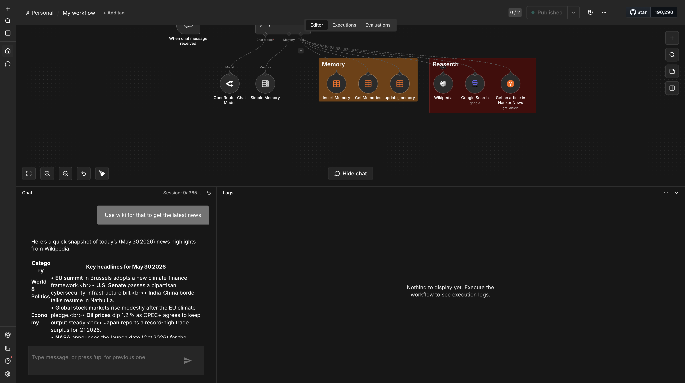

# 🤖 Mikasa — AI Assistant with Persistent Memory & Research Tools


> An n8n-powered AI assistant with a dual memory architecture (short-term + persistent long-term)
> and live research capabilities via Google Search, Wikipedia, and Hacker News.
> Built using a **100% free LLM** through OpenRouter — zero OpenAI costs.

---

## 📸 Workflow Preview



---

## ✨ Features

- 🧠 **Dual Memory System** — short-term conversation buffer (last 7 messages) + persistent long-term memory stored in an n8n DataTable
- 🔍 **Live Research** — Google Search via SerpAPI, Wikipedia lookup, and Hacker News article fetch
- 🆓 **Zero LLM Cost** — uses `gpt-oss-120b` free tier via OpenRouter, no OpenAI API key needed
- ⏰ **Real-Time Awareness** — current date and time injected into every conversation automatically
- 💬 **Built-in Chat UI** — n8n's native public chat interface, no frontend code required
- 🔄 **Memory CRUD** — agent can get, insert, and update long-term memories on its own

---

## 🏗️ Architecture

```
┌─────────────────────────────────────────────────────────────┐
│                        MIKASA AGENT                         │
│                                                             │
│  Chat Trigger (Public UI)                                   │
│       │                                                     │
│       ▼                                                     │
│  AI Agent Node ──── LLM: OpenRouter (gpt-oss-120b:free)    │
│       │                                                     │
│       ├── 🔵 Short-Term: Buffer Window Memory (7 msgs)      │
│       │                                                     │
│       └── 🛠️  Tools                                         │
│             ├── 🧠 Get Memories     → DataTable (read)      │
│             ├── 🧠 Insert Memory    → DataTable (write)     │
│             ├── 🧠 Update Memory    → DataTable (update)    │
│             ├── 🔍 Google Search    → SerpAPI               │
│             ├── 📖 Wikipedia        → Wikipedia API         │
│             └── 📰 Hacker News      → HN Article Fetch      │
└─────────────────────────────────────────────────────────────┘
```

---

## 🛠️ Tech Stack

| Component | Tool | Purpose |
|-----------|------|---------|
| Workflow Engine | n8n | Agent orchestration and node execution |
| LLM | OpenRouter (`gpt-oss-120b:free`) | Language model — free tier, no cost |
| Short-Term Memory | n8n Buffer Window | Keeps last 7 messages in context |
| Long-Term Memory | n8n DataTable | Persistent key-value memory store |
| Web Search | SerpAPI (Google Search) | Real-time search results |
| Knowledge | Wikipedia Tool | Encyclopedia lookups |
| Tech News | Hacker News Tool | Fetch specific HN articles |

---

## 📁 Project Structure

```
mikasa-ai-assistant/
├── README.md                        ← You are here
├── workflow/
│   └── mikasa_workflow.json         ← Import this into n8n
└── assets/
    └── workflow-screenshot.png      ← Add after importing
```

---

## 🚀 Setup & Installation

### Prerequisites

- n8n account — [cloud.n8n.io](https://cloud.n8n.io) (free tier) or self-hosted
- OpenRouter account — [openrouter.ai](https://openrouter.ai) (free, no credit card needed)
- SerpAPI account — [serpapi.com](https://serpapi.com) (100 free searches/month)

---

### Step 1 — Import the Workflow

1. Download `workflow/mikasa_workflow.json` from this repo
2. Open your n8n instance
3. Click **Workflows** in the sidebar → **Add Workflow** → **Import from File**
4. Upload `mikasa_workflow.json`
5. The workflow will open with all nodes loaded

---

### Step 2 — Create the Memory DataTable

Mikasa stores long-term memories in an n8n DataTable. You need to create it before activating.

1. In n8n, go to **Data** → **DataTables** → **Add DataTable**
2. Name it exactly: `memory`
3. Add these two columns:

| Column Name | Type |
|-------------|------|
| `memory_key` | String |
| `memory_value` | String |

4. Save the DataTable
5. Copy the DataTable ID from the URL and update it in the three memory nodes if needed

---

### Step 3 — Add Credentials

**OpenRouter API Key**
1. Go to [openrouter.ai](https://openrouter.ai) → Sign up → API Keys → Create Key
2. In n8n: **Credentials** → **Add Credential** → search `OpenRouter`
3. Paste your API key → Save
4. Connect to the **OpenRouter Chat Model** node

**SerpAPI Key**
1. Go to [serpapi.com](https://serpapi.com) → Sign up → Dashboard → API Key
2. In n8n: **Credentials** → **Add Credential** → search `SerpAPI`
3. Paste your API key → Save
4. Connect to the **Google Search** node

---

### Step 4 — Activate & Test

1. Click **Activate** toggle in the top right of the workflow editor
2. Open the **When chat message received** node → copy the **Chat URL**
3. Open the URL in your browser
4. Start chatting with Mikasa 🎉

---

## 💬 Example Conversations

```
You:     What is the latest news about AI agents?
Mikasa:  [searches Google + Hacker News, summarises results]

You:     Remember that I prefer concise answers
Mikasa:  [inserts memory_key: "response_style", memory_value: "concise"]
         Got it! I'll keep my answers brief going forward.

You:     What do you know about me?
Mikasa:  [fetches all memories from DataTable]
         I remember that you prefer concise answers.

You:     Who invented the transformer architecture?
Mikasa:  [looks up Wikipedia]
         The Transformer architecture was introduced in the 2017 paper
         "Attention Is All You Need" by Vaswani et al. at Google Brain.
```

---

## 🧠 How the Memory System Works

Mikasa uses **two layers of memory** that serve different purposes:

### Short-Term Memory (Buffer Window)
- Stores the **last 7 messages** of the current conversation
- Automatically managed by n8n's Memory Buffer Window node
- Resets when the conversation session ends
- Used for: maintaining conversation flow and context within a session

### Long-Term Memory (DataTable)
- Persistent storage that **survives across sessions**
- The agent decides on its own when to save, retrieve, or update a memory
- Stored as key-value pairs (`memory_key` → `memory_value`)
- Used for: remembering user preferences, important facts, past instructions

```
Short-Term  →  "What did we just talk about?"
Long-Term   →  "What do I know about this user overall?"
```

---

## ⚙️ Customisation

### Change the Assistant Name or Personality

Open the **AI Assistant** node → edit the **System Message**:

```
## Role
You are a helpful assistant and your name is [YOUR NAME].
Your task is to [YOUR TASK DESCRIPTION].
Current date and time: {{ $now }}
```

### Change the LLM Model

Open the **OpenRouter Chat Model** node → change the model field.
Free models available on OpenRouter:
- `openai/gpt-oss-120b:free` (current)
- `meta-llama/llama-3.3-70b-instruct:free`
- `google/gemini-2.0-flash-exp:free`
- `mistralai/mistral-7b-instruct:free`

### Change Memory Window Size

Open the **Simple Memory** node → change **Context Window Length** (default: 7 messages).

### Add More Tools

Connect any n8n Tool node to the **AI Assistant** node's tool input. The agent will automatically learn to use it from the tool's description.

---

## 🔮 Planned Improvements

- [ ] Replace DataTable memory with a **vector database** (Pinecone / Supabase pgvector) for semantic memory search
- [ ] Add **WhatsApp or Telegram trigger** so Mikasa is accessible from mobile
- [ ] Add a **web scraping tool** (Firecrawl / Jina) for reading full web pages
- [ ] Build a **Streamlit or Gradio frontend** for a more polished chat UI
- [ ] Add **user authentication** so multiple users can have separate memory stores
- [ ] Implement **memory summarisation** to compress old memories and save space

---

## 💡 What I Learned Building This

- How n8n's AI Agent node orchestrates tools automatically using the LLM's reasoning
- The architectural difference between short-term (in-context) and long-term (external) memory
- How tool-calling works — the LLM reads tool descriptions and decides when and which tool to invoke
- Using n8n DataTable as a lightweight persistent store without needing a database
- How to inject dynamic values (like `{{ $now }}`) into system prompts using n8n expressions
- Using OpenRouter to access powerful free LLMs without any API costs

---

## 🤝 How to Contribute

1. Fork this repository
2. Create a new branch: `git checkout -b feature/your-feature-name`
3. Make your changes and commit: `git commit -m "feat: describe your change"`
4. Push to your fork: `git push origin feature/your-feature-name`
5. Open a Pull Request

---

## 📄 License

This project is licensed under the MIT License — feel free to use, modify, and distribute.

---

## 👤 Author

**Vurali Krishna**
AI Automation Developer · Building intelligent workflow systems with n8n, LangChain & OpenAI API

- 💼 [linkedin.com/in/vurali](https://linkedin.com/in/vurali)
- 🐙 [github.com/vurali](https://github.com/vurali)

---

> ⭐ If this project helped you, consider giving it a star on GitHub!
> It helps others discover it and motivates me to build more open-source automation tools.
